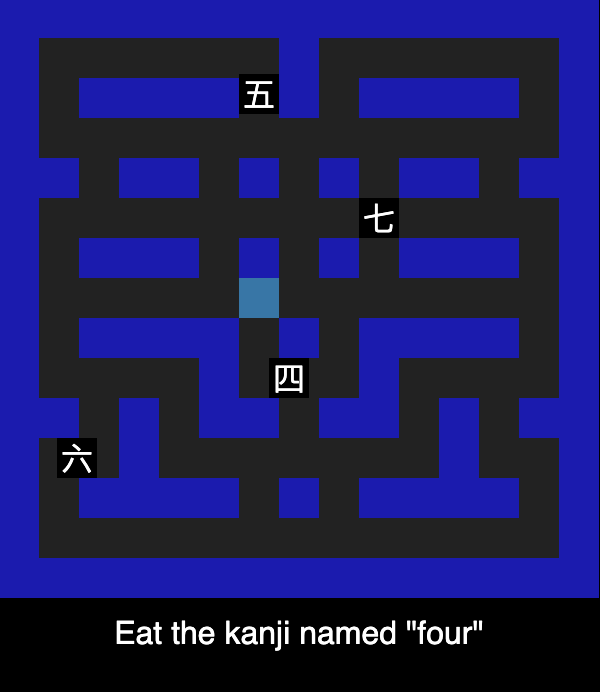

# Elm Kanji Pacman

Learn Kanji by playing Pac-Man!

Built with [Elm](https://elm-lang.org) and [Elm Land](https://elm.land).

## Screenshots



## Local development

```bash
# Requires Node.js v18+ (https://nodejs.org)
npx elm-land server
```

## Credits

- [Pac-Man](https://en.wikipedia.org/wiki/Pac-Man) for design inspiration
- Heisig's [Remembering the Kanji](https://en.wikipedia.org/wiki/Remembering_the_Kanji_and_Remembering_the_Hanzi) for kanji ordering and definitions
